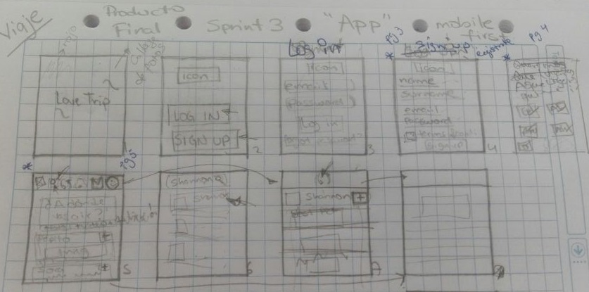

# TravelerPoint
------

## Introducción

Este proyecto es el **PRODUCTO FINAL** del Sprint 3 **"CREA TU PROPIA RED SOCIAL"**.

Algunos de los requerimientos que nos pidieron para realizar este producto fueron los siguientes:

  + Perfiles de usuarios.
  + Un newsfeed donde puedes ver las actualizaciones de todos tus contactos.
  + Un lugar donde poder escribir posts.
  + Un lugar para subir fotos.
  + Capacidad para poder tener amigos o para poder seguir a personas/marcas dentro de la red social.
  + Ser mobile friendly.

## Objetivo: Crear un red social

## Proceso de creación

### **Elección y dibujo del sketch de baja fidelidad**

Al poder elegir un tema al azar para la creación de la red social, como primeros steps fueron hacer checklist de los temas que podríamos usar en una red social. Quedando así dos temas a nuestra elección "viajes y moda", luego se hizo un sketch de cada uno para pasar a testearlos a 5 personas entre hombres y mujeres de 18-24años; para al final del test comprobar que al público le interesa más un app de viajes que de moda. 

Después del testing, se realizó el siguiente sketch ya con el tema elegido:

El scketch nos muestra el flujo que debería seguir nuestra red social. 

Inicia con la presentación del nombre de la red social (en el sketch es Love trip, pero en el MPV es Traveler Point) para luego de unos segundo de espera nos muestre una segunda pantalla en la cuál observamos los botones de sing up y log in. 

Al hacerle click a log in, nos envía a un formulario en el cuál ingresaremos nuestro email y contraseña. Al darle click en el boton log in nos redirecciona a la pantalla de inicio en la cuál podremos observar el newfeed. 

Al hacerle click a sing up, nos envía a un formulario en el cuál ingresaremso el nombre, apellido, correo y contraseña. Al darle click en el boton sing up nos redirecciona a la siguiente pantalla, la cuál es un listado con imágenes de los lugares que te gustan o desearías conocer. Finalmente, al hacerle click al boton end nos redirecciona a la pantalla de inicio en la cuál podemos observar el newsfeed.

En esta pantalla de inicio en el header se observan una serie de botones los cuales tienen ciertas caracteristicas, por ejemplo, si le damos click al emoji face nos dirige al perfil del ususario, si le damos click al icono lupa nos dirige a otra pantalla en la cual nos mostrará el listado de amigos y podremos realizar la búsqueda. 

### **Diseño del prototipo**

En la sección anterior describimos el sketch sobre el cuál empezamos a trabajar, sin embargo, a lo largo del trabajo se han realizado modificaciones en pro de tener un mejor MPV.

Al ingresar desde el link de gh-pages, nos vamos a dirigir a la primera vista en la cuál nos va a mostrar el nombre de la red social **Traveler Point** 

*Archivos usados index.html, index.js y main.css* 

Después de unos segundos (4s) nos va a dirigir a la siguiente pantalla en la cuál vamos a visualizar dos botones, los cules son LOG IN y SIGN UP. 

*Archivos usados pagina1.html y main.css* 

Nos ponemos del lado de un usuario que por primera vez descarga Traveler Point y, como en toda aplicación que uno es nuevo, debe registrarse. 

Para registrarse debe cumplir algunos mínimos:

  + Nombre de usuario menor a 10 caracteres.
  + Contraseña con al menos 6 caracteres.
  + Confimar contraseña.
  + Darle check para aceptar los términos y condiciones. 

*Archivos usados pagina3.html, pagina1.js y main.css* 

Los datos como nombre de usario, email y contraseña son alamcenaados en el local storage de la computadora. 

*Archivos usados pagina3.html, pagina1.js y main.css* 

Luego de darle click al botón GET STARTED nos va a dirigir a la siguiente pantalla en la cual observamos diversas imágenes sobe países que harán de filtros para poder seleccionarlas y cuando nos redireccione a la pantalla de inicio nos sugieraa perfiles de Travelers que hayan estado ene stos lugares. 

*Archivos usados pagina4.html y main.css*  

Una vez hecha la selección de lugares, al hacerle click a Enjoy nos vamos a dirigir a la pantalla de inicio.

*Archivos usados pagina5.html y main.css* 

Y también si le damos click a LET'S GO en LOG IN nos vamos a dirigir a la pantalla de inicio.

*Archivos usados pagina2.html, pagina2.js y main.css*

Ahora sí, vamos a la pantalla inicio.

Observamos en la parte superior de la pantalla inicio un botón "+" el cuál nos sirve para postear y/o publicar archivos en nuestro newsfeed. Además podemos pre visualizar la imagen que estamos por publicar.

*Archivos usados pagina5.html, pagina5.js y main.css* 

Posteamos un mensaje en el cual nos aparece la hora en la que fue posteado.

En la parte inferior de la pantalla podemos observar varios íconos, el último de ellos nos dirige al perfil del usuario.

*Archivos usados pagina6.html y main.css* 

En la parte superior del perfil del usuario vemos un ícono el cuál si le damos click...

Nos dirige a la pantalla en la cuál decidiremos si ingresar porque ya tenemos una cuenta creada o si deseamos crearnos una nueva.

### **Observaciones**

Al empezar a realizar el producto, nos interesamos por usar Firebase para poder hacer una validación y almacenamiento de nuestros usuarios que deseen registrarse. En el camino se presentaron varios inconvenientes, uno de ellos fue si le poníamos otra función aparte de la de Firebase al botón, este ya no almacenaba los datos y solo nos redireccionaba a la siguiente vista. Tratamos de solucionarlo sobre la marcha sin embargo ya le habíamos invertido varias horas así que decidimos usar el Local Storage para almacenar los datos del usuario.

Otro incoveniente que tuvimos fue al momento de publicar/postear podemos ingresar texto y hacer que aparezca en el newsfeed pero no podemos publicar las imágenes a pesar de que carga y se pre-visualiza y que aún estamos trabajando en imprimir el comentario/imagen en la parte de arriba. 

En el caso del filtrado, creamos una pequeña base de datos en la cuál nos aparece en un primer momento los nombres de esas personas pero cuando queremos buscar por alguna letra se esconden todos los nombres. 

## Autoras

  + Rocio Quilla. 
  + Shannon Rivera. 

